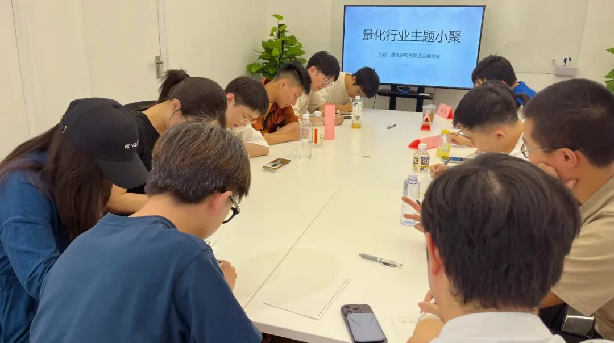

### 主题回顾

**本次主题**：量化研究员职业发展图鉴

**主题背景**：根据中国量化白皮书调查显示，行业内普遍认为做好 Quant 的关键素质先后顺序分别是：扎实的专业技能、聪明、快速领悟、对世界的认知、勤奋努力。聪明有助于单次研究的胜率，而努力则决定长期的水平。当下行业人均学历卷的不能再卷的情况下，还有什么因素推动了一个 Quant 从优秀走向卓越？

**交流话题**：1.从业者分享自己的职业生涯，如入行原因、工作内容、职业发展？2.如何开启自己的第一个实盘交易？3.如何更好地结合传统投资理论和量化技术构建投资策略？4.如何提升自己在团队中的领导力与全面素质？5.从业过程中遇到的困惑与心得感悟分享？

---

### 小聚成员

本次活动根据大家填写的报名表，依照“深度交流+多元讨论”的主旨，一共邀请15位小伙伴参与，从事量化行业全职工作的伙伴5位，目前在量化行业实习的伙伴10位，值得一提的是，参与本次小聚的全职和实习伙伴所在公司多为知名百亿私募、头部券商、自营机构。

---

### 活动反馈

之前一直想参加这个活动，今天逮到机会啦。认识了很多行业的大佬和超级聪明的人，了解了市场上目前一些之前没做过的产品的方法论，然后认识到了市场真的很卷！**——某迷茫的full time quant**

什么情况能同时见到10多位各家百亿私募的Quant们！感谢主办方提供这样的机会，了解了很多行业信息，也结识了志同道合的朋友，多多交流。**——量化从业者一枚**

非常荣幸能够与许多量化小伙伴一起交流，今天最大的收获就是加深了对不同量化公司（私募、公募、券商自营等）以及不同岗位（股票、CTA、机器学习、组合优化）的理解，这是一次对自我视野的开阔。**——不算太白的quant小白**

大家对Barra框架，alpha挖掘的讨论十分热烈，听了很有启发，也对不同公司的管理风格有了更多了解，对未来择业有所参考。**——某量化实习生小白一枚**

今天的行业小聚让我认识了许多不同机构的朋友，他们任职于券商自营、私募CTA、私募高频等岗位，让我了解了不同机构的工作风格。度过了充实的一下午，非常感谢能有参加活动。**——某Quant**

同在量化行业中，大家的研究模式和评价标准却有很大差别。今天了解到了更多的风格，券商和各类典型量化私募的不同风格，单打独斗、流水线等。以后可以更多尝试！**——上海某厂研究员**

今天认识了很多行业内从业的小伙伴，了解了很多行业内的“秘闻”和前沿消息，也对量化研究员这个职业发展有了更深刻的认识，希望下次还有机会参加。**——某外资Quant小白**

听同辈分享实习和就业经历，了解其他方向的工作重点，对自己的就业选择有参考。**——某上海股多的研究员**

了解不同部门/公司对策略设计原则，更加清楚行业/职业的方向与前景，认识了很多有趣的朋友。**——某量化实习工人**

感谢高老师组织的这次行业小聚活动，通过众多百亿私募大佬的发言了解到了一些行业趣闻、技术干货，极大地为我们减少了信息差，特别是某百亿学长，某头部券商自营学长，某百亿小姐姐有针对性的提问和发言，了解到了很多量化私募行业隐秘的信息，也祝大家前程似锦！**——某上海百亿量化私募实习生**

了解了很多同行入职的理由与困惑，知道了券商与私募的gap，对职业规划更清晰了。**——某上海小矿**

今天对职业发展的认知更清晰，对行业现状、经营模式有了初步的了解。对量化的认识不仅仅存在于技术层面。另外，认识了聪明的大脑们，开阔了视野，对量化行业的兴趣更浓厚，非常期待在量化行业有所作为！**——一名刚入行的小白实习生**

听到了大佬们的精彩讨论并参与其中，感到非常荣幸。从职业、公司到专业问题都有覆盖，祝大家事业蒸蒸日上，win rate和pnl ratio越来越高！**——勇闯上海啥都做过的quant intern**

