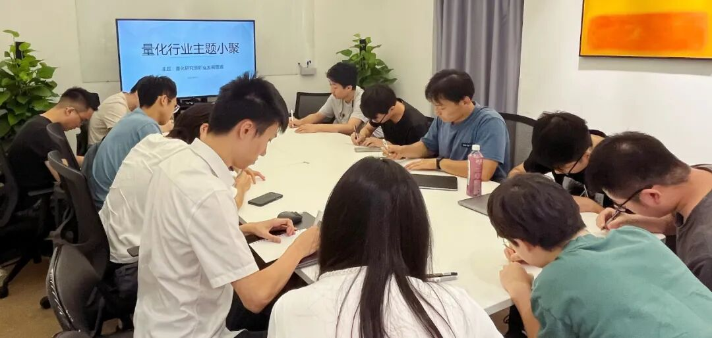

### 主题回顾

**本次主题**：量化行业多岗位 Q&A

**主题背景**：截至2022年12月末，在协会备案登记的私募证券基金管理人数中涉及量化策略的机构共计2293家，其中100亿以上规模共计39家，50~100亿规模共计36家，10~50亿规模共计310家。各家私募在市场中的特色优势、发展途径等都千差万别，了解行业生态及各家工作方式，更有助于提升我们的行业认知与竞争力。

**交流话题**：1.从业者分享自己的职业生涯，如入行原因、工作内容、职业发展？2.量化行业中各岗位从业人员对本职工作的见解交流？3.工作中遇到的困难与挑战，以及解决方案的分享与讨论？4.如何建构个人在行业中的竞争力？

---

### Q&A 成员

本次活动根据大家填写的报名表，依照“深度交流+多元讨论”的主旨，一共邀请15位小伙伴参与，从事量化行业全职工作的伙伴5位，目前在量化行业实习的伙伴10位，值得一提的是，参与本次小聚的全职和实习伙伴所在公司多为知名百亿私募、头部券商与公募。

---

### 活动反馈

见到同行总是倍感兴奋，极大的拓宽了轻微社恐人士的社交范围，很多时候线上交流总会尴尬住，但是线下的群聊则可以完美解决这个问题，不同私募研究员就话题你来我往的讨论，仿佛再次回到了学生时代！**——某私募从业小小白**

今天的量化小聚中对行业的一些趋势有了更丰富的认识。未来很有可能会加强龙头效应，百亿私募的竞争力可能会更强，中小私募则需要更好的业绩或者独特性才能在行业内占有一席之地。同时，私募的流水线模式也让出去单干、开新私募变的越来越困难。这都是我们研究员必须面对的困难和挑战。**——某百亿私募Quant**

感谢主办方和参加小伙伴的发言，了解到很多行业相关的信息，如某家主打的特色产品结构，未来管理规模的分布变化等。收获良多，希望未来还有机会参加。**——某研究CTA的量化小白**

今天某百亿的QR讲的知识对我有很大启发，他的工作alpha方向和我目前的工作比较相像，因此我问的技术问题也会比较多，了解到了作为alpha研究员之后所面临的职业瓶颈以及挑战，作为一个刚刚进入百亿私募的量化小白而言，具有很大的帮助，希望日后量化路能更顺。**——某百亿私募量化小白**

今天的活动很有收获。和各位小伙伴聊了很多各式各样的问题，也从百亿私募大佬那里得到了蛮多启发。虽然时间比较短暂，但收获满满，而且结识了很多新的朋友，交流可以很好的避免闭门造车，希望后面可以多多参加这样的活动。**——一名不断学习的量化小白**

启发和收获：了解到量化私募大厂的因子库规模，了解到量化行业平均薪资水平及竞业问题的解决方案，行业就业路径。**——某上海初创量化私募基金管理有限公司 Quant量化策略研究员**

从两位大佬的发言中收获很多，某百亿大佬讲述了他的工作流程以及方法论，另一位大佬讲述了QR的职业发展路线，另外主持人围绕着有趣的比方说明了市场情况、大小企业的对比、个人职业路线等，收获很多。**——某刚入行萌新**

真的很高兴今天能来参加这次量化行业Q&A，作为一个年级很低的量化新人，坦白讲，我对这个行业的技术生态，以及未来的职业发展路径还有很多的未知。今天来交流的哥哥姐姐们有的在读研究生，有的正在找工作，也有的已经在这个行业耕耘了很多年，取得了不俗的成绩。令我印象深刻的是，我就CTA相关的技术问题向一位工作了几年的前辈请教，他也十分耐心地回答了我的问题。今天的这场量化行业Q&A真的非常nice！祝越办越好！**——一个刚入行量化的准大三学生**

今天一位百亿研究员大佬分享了不少研究员做因子的方法论，对比了量化行业的PM模式与工厂流水线模式，分享了有趣的内幕与“八卦”，我作为刚入行的开发，想更了解这个行业的主力研究员，所以今天来了这个Q&A，很有意思。感谢主办方的组织。**——某刚入行Crypto Dev**

很多人的分享都比较有意思，收获：1.目前还是以股票挖因子为主，CTA、加密货币也有一些涉及，但其他金融产品的关注较少，2.关于行业的认识，包括各种规模、私募公募的一些信息，以及各种机构的因子情况等等。**——对期权交易有一定兴趣的学生**

了解到量化行业现状，以及各个方面发展情况。Q&A上有大私募研究员介绍自己的一些见解和看法，收获颇多。也讨论了量化行业的出路，比如资深员工一般会自己出去干或者成为合伙人。这次小聚对整个行业有了更深刻的了解。**——某量化小白**

今天的交流之收获：1.了解了百亿私募的一些情况，中大小型私募各有优势，某百亿大佬的发言真的令我长了很多见识！2.其实国内股票alpha很卷，QR的未来发展也确实需要进行全面的分析与研判。**——某Quant，热爱唱歌乐器，也热爱人文社科金融法律，欢迎和我一起玩**

可以在相对自由的环境，探讨一些平时在公司中无法讨论的内容，对量化这整个大方向上听闻了更多的故事，很感谢某百亿大佬的分享，至少在因子方向上给到了一些启发吧~**——某上海量化私募研究员一枚**

