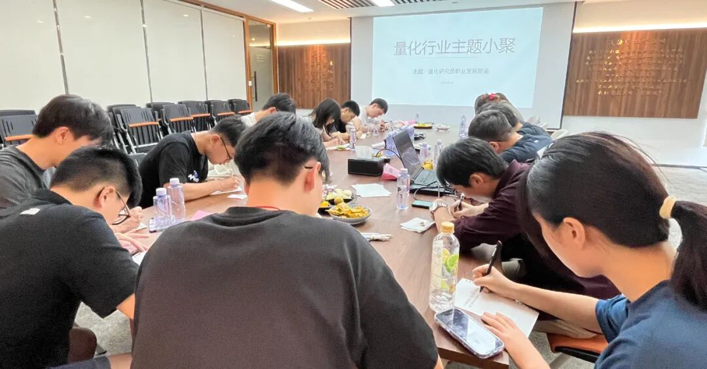

### 主题回顾

**本次主题**：量化研究员职业发展图鉴

**主题背景**：根据中国量化白皮书调查显示，行业内普遍认为做好 Quant 的关键素质先后顺序分别是：扎实的专业技能、聪明、快速领悟、对世界的认知、勤奋努力。聪明有助于单次研究的胜率，而努力则决定长期的水平。当下行业人均学历卷的不能再卷的情况下，还有什么因素推动了一个 Quant 从优秀走向卓越？

**交流话题**：1.从业者分享自己的职业生涯，如工作内容、职业发展等？2.研究因子或策略遇到瓶颈时可以通过哪些渠道获得有启发性的研究报告，或从哪些角度对策略进行思考改进？3.量化研究范式、流程与如何更好地结合传统投资理论构建投资策略？4.量化行业通常很少有详细带教，如何有效破局快速成长？5.从业过程中遇到的困惑与心得感悟分享？

---

### 小聚成员

本次活动根据大家填写的报名表，依照“深度交流+多元讨论”的主旨，一共邀请15位小伙伴参与，从事量化行业全职工作的伙伴8位，目前在量化行业实习的伙伴7位，值得一提的是，参与本次小聚的全职和实习伙伴所在公司多为知名百亿私募、头部券商、自营机构。

---

### 活动反馈

今天的交流中有两点信息让我很受启发，第一点是，量化交易本质上和主观密切相关，在研究与交易的时候都应该将两者结合起来。第二点是，朋友们分享的大佬发言：“真正成功的策略往往是一句话的事”。虽然我暂时还不能完全理解大道至简的真实内涵与实现途径，但这句话还是给我的职业发展带来了很大的启发。**——一名新手小Quant**

J老师的主观+量化结合的思路很好，作为cs从业者不止把市场看做数据，当成行为去研究。对未来的职业发展也更加的清晰，了解了更多量化行业更具体的信息，希望未来有更多机会参加。**——啥都会点啥都不精通的cs研究生**

今天D哥分享的某量化大佬的三句话使我深受启发，其中有一句话是说，量化交易其实也都是在做板上钉钉的事，但这些事很难做。同时不要妄图做预测。虽说挖因子也是在寻找有预测性的特征，但很多稳定不易失效的因子都基于明确的逻辑，也是板上钉钉的现象的量化。**——某深圳量化私募Quant转行PHD一枚**

今天J老师对于一些CTA策略以及主观策略之间的联系令我印象深刻。我了解到原来做高频的策略也需要通过主观去对模型的参数实现调整，以及在高频交易中他们会观察一些挂单行为（往往肉眼可见的有问题的一些挂单），他们从这些细节的市场行为中再去对模型调整，从而在对手方获利。**——某深圳Quant实习生**

1.某位做数字货币的交易系统的大佬对我启发最大。2.启发：对于想从中低频转高频的研究员，需要具备的硬件技能（C++、Rust），此外交易（实盘交易）对于研究员的个人发展是很有好处的，原因：1）培养盘感 2）对市场的运行有更深刻的了解 3）量化策略与交易系统的接轨。3.研究员的个人特质：专注、聪明。**——中低频因子挖掘实习生（入行一年，归来仍是中低频）**

很高兴参加今天的活动，A老师和J老师的发言很有启发，对于高频交易和不同资产类型有了更深的理解。**——量化探索小白**

A和J的发言让我有所收获，主要是在加密货币高频这一块给了我一些研究的启发，如何有效的动态更新策略，其次是FOF的玩法，之前有接触和玩过，思路大致相同，但也有了一些有意思的发现。**——某深圳私募Quant，喜欢交朋友，比较安静**

很高兴今天能来参加量化小聚，认识了很多就职于不同量化机构、岗位的前辈，也对未来的职业规划有了更清晰的认知，很感谢能有这样一个学习交流的平台。**——某量化实习生小白**

非常开心！参加了超级量化的线下小聚，跟业内优秀同僚探讨量化CTA的失效问题，和未来的发展方向，和crypto高频朋友深入探讨主观和量化的相辅相成的关系，相信对自己未来的量化研究会有很大帮助！**——某匿名高频Quant**

今天收获了很多关于高频、做市、交易方面的见闻。有很多角度新奇的观点和想法，很有意思！**——中低频股票因子，机器学习**

启发之一：在思考研究问题时不光用P-Quant的思路框架，也要考虑Q-Quant的思考方式，从定价的角度入手，丰富框架和解法，尤其是期权相关的策略上，另外，关注一些做市商相关的角度很有意思。启发之二：在量化上发展需要热情和自我驱动，也要参与市场在交易尝试中沉淀。活动很棒，有机会还想参与！**——充满好奇期待成长的量化行业小白**

听到了一些其他研究员关于市场的看法，也了解了一些其他研究员和同学的职业发展路径，收获还是比较多的。**——某刚入职的量化新人**

又来到线下分享会啦！印象比较深的是同业中做期货期权的大佬们，希望能在多资产品种中有更多探索，也得到很多很宝贵的建议。量化同样要回到交易本身，亲身去体会市场的变化比听百节课效果都好，找到喜欢的市场和节奏就能在市场中走得更远！**——某深圳本土量化非典型研究员**

今天在深圳很高兴参加了东哥举办的量化活动，尤其印象深刻的是大家对CTA，加密货币（同时也是我未接触）的领域有一个深入了解，对交易系统的开发和主观量化相结合有一个更好的理解。**——某北京小私募Quant一枚**

今天J老师的期权高频让我了解了期权的玩法。**——量化研究员**

