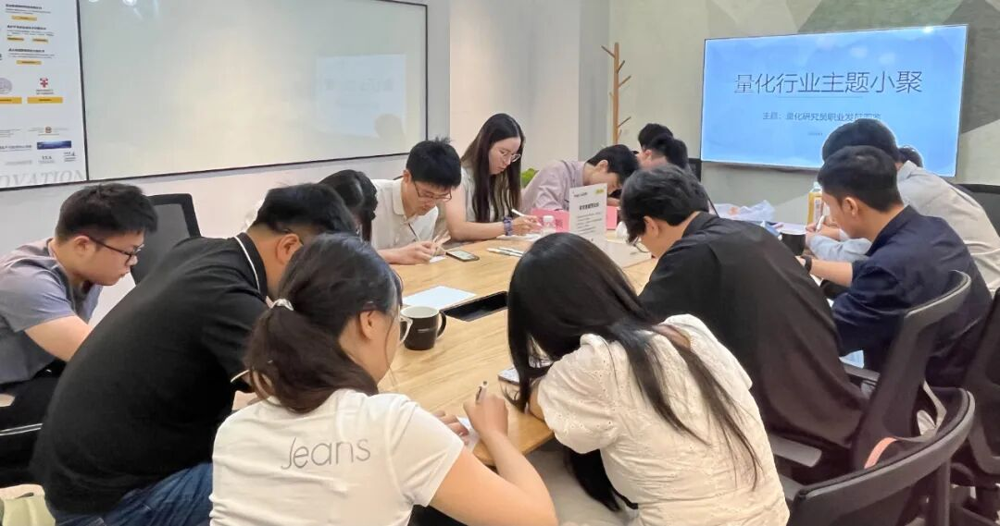

### 主题回顾

**本次主题**：量化研究员职业发展图鉴

**主题背景**：根据中国量化白皮书调查显示，行业内普遍认为做好 Quant 的关键素质先后顺序分别是：扎实的专业技能、聪明、快速领悟、对世界的认知、勤奋努力。聪明有助于单次研究的胜率，而努力则决定长期的水平。当下行业人均学历卷的不能再卷的情况下，还有什么因素推动了一个 Quant 从优秀走向卓越？

**交流话题**：1.从业者分享自己的职业生涯，如工作内容、职业发展等？2.研究因子或策略遇到瓶颈时可以通过哪些渠道获得有启发性的研究报告，或从哪些角度对策略进行思考改进？3.量化CTA的研究内容，市场参与者结构的变化与量化CTA遇到的挑战？4.不同公司面试感受与实习经历？5.从业过程中遇到的困惑与心得感悟分享？

---

### 小聚成员

本次活动根据大家填写的报名表，依照“深度交流+多元讨论”的主旨，一共邀请15位小伙伴参与，从事量化行业全职工作的伙伴7位，目前在量化行业实习的伙伴8位，值得一提的是，参与本次小聚的全职和实习伙伴所在公司多为知名百亿私募、头部券商、自营机构。

---

### 活动反馈

今天非常开心参加量化线下小聚，从各不同的角度和方向了解到量化更多的维度和特点，对机器学习AI在量化中的应用和未来的发展有了新的认识。量化只会越来越卷，唯有强化自己的特有技能才能alpha！**——某成都北漂的量化研究实习生**

今天储同学的发言对我很有启发！之前我关注的重点在股票因子的产出上，忽略了因子的组合优化，所以最后合成后的提升相比于单因子不是很明显，后来因为这个比较灰心，就没有继续选择量化私募，毕竟国内以做股票为主，今后可以尝试用机器学习的方法来处理信号。**——某三中一华新人**

今天有计算机学长分享的做模型时候的小trick令人受益匪浅，掌握了一些没有了解过的方向。以及两位工作老师的分享，极大的增强了我的知识面，对于量化的理解进一步提高。今天最大的收获在于进一步了解了自身未来可能的职业规划。**——某不知名小白**

1.褚学长，辛老师和周老师etc.（有收获的太多的，就先写三个了）like机器学习模型的具体tips，目前marlcet的趋势，以及大家对业内职业规划的看法。2.Information gathering+networking 因为我的哲学一直是接触不同有意思的人，然后向大家学习，弥补信息差，so I think 今天的信息密度还是很dense的。**——CS×SEM的好玩的人**

某CTA大佬的发言让我感受到职业发展中规划和思考的重要性，不能只满足于做一个技术人员，而得有自己的独特性。在这次小聚中增加了更多对ml在量化中应用的了解，如一些trick等。也认识了各种优秀的人，对自己有了更多的期待。**——某quant打工人**

今天在和大家的沟通中，对CTA的时段回撤，深度学习与机器学习的因子组合，与小trick有了一个更加深入的理解，和x总的沟通中对职业规划也有了一个明确的认识。**——某北京私募实习生小白**

今天在这里收获挺多，一些做模型的大佬也分享了一些自己在模型组合优化的trick，听来也很受启发，此外，也听很多同学分享了自己在笔面试的经验，也很受用。**——某量化小白**

1.今天每个人都非常专业，无私和热情。2.对CTA中低频的alpha和未来机器学习发展对我非常有启发。**——私募从业者**

1.今天杨同学的发言让我收获不少，他发表了一些关于挖因子与神经网络的看法，张同学也发表了一些关于面试、笔试的经验。2，了解了一些外资企业，如Jump、Tower了解了一些行业里面的瓜（很有趣）。**——热爱Quantum的Quant**

收获：某位在深度学习领域研究经历丰富的同学分享了许多组合优化的技巧，对我帮助很大，感谢主办方组织这次活动！期待下次交流。**——券商自营交易员**

今天很高兴参加这次量化小聚，分了股票和期货两个主题展开讨论，其中股票主题的一些因子组合技术让我很受启发，通过这次交流，加深了对于AI模型在选股上应用的方法论的理解。**——北京Quant实习生一枚**

今天了解到了一些量化研究员实习的经历，获得了一些行业最新动态，对以后做策略有一定指导意义。**——量化CTA quant一枚**
对机器学习模型的改进提升经验对我很有启发，最大收获是，对量化行业各子领域有了更深的了解！**——某Quant**

