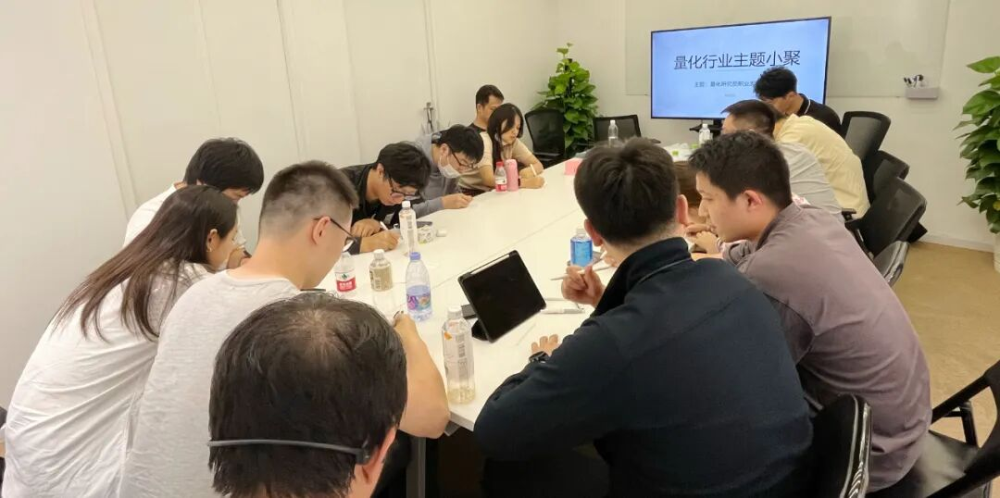

### 主题回顾

**本次主题**：量化研究员职业发展图鉴

**主题背景**：根据中国量化白皮书调查显示，行业内普遍认为做好 Quant 的关键素质先后顺序分别是：扎实的专业技能、聪明、快速领悟、对世界的认知、勤奋努力。聪明有助于单次研究的胜率，而努力则决定长期的水平。当下行业人均学历卷的不能再卷的情况下，还有什么因素推动了一个 Quant 从优秀走向卓越？

**交流话题**：1.从业者分享自己的职业生涯，如工作内容、职业发展等？2.量化行业细分方向选择，高频数据/深度学习模型理解应用？3.高频交易基于order book与国内CTA策略讨论？4.t0股票机器学习模型的信号组合和数据处理与隔日中长期股票策略？5.从业过程中遇到的困惑与心得感悟分享？

---

### 小聚成员

本次活动根据大家填写的报名表，依照“深度交流+多元讨论”的主旨，一共邀请15位小伙伴参与，从事量化行业全职工作的伙伴9位，目前在量化行业实习的伙伴6位，值得一提的是，参与本次小聚的全职和实习伙伴所在公司多为知名百亿私募、头部券商、自营机构。

---

### 活动反馈

今天的交流在各个方面都对我从事量化的工作内容和职业发展都扩展了认知面。通过其他研究员和私募或HF资深研究员的交流，我感觉到深度学习模型的一些使用深度和场景，对于自身而言，更多看到了业内的发展方向，大家关注的重点，以及将来自己需要拓展的知识点。**——上海初入门Quant**

和大家讨论了AI在量化交易中的实战和研究方向。**——量化研究员**

今天在交流中得到了很多启发，了解了自己原先未接触过的一些领域。比如中低频策略中对数据的处理，信号的生成等，也对自己未来职业规划有了更清晰的认知。**——某刚入行的量化小白**

大家聊得都很偏技术，自己还是一个量化这块的门外汉，对几位在量化行业深耕多年的（比如一位是清华的博士以及坐他旁边那位）聊得内容印象深刻。希望多多了解量化吧。**——理性思考者**

1.学长对于量化中深度学习的应用让我有了一些新的思路，包括对数据处理和频率上的一些应用。2.对于各个公司的一些奇奇怪怪的八卦有了一些了解。3.对crypto这个方向有一些认知，一些基本的策略方向有所了解。**——一只想做量化的菜鸡**

J老师和闫老师关于全职工作的思考很有帮助，尤其是对于DL实际运用场景的讨论，还有其他朋友讲的难点，也让我很有同感。**——想当职业牌手的Quant**

能够在一个公共平台和同行相聚探讨关于这个外界认为比较神秘的行业的认知，是一件有趣而又有意义的事，希望以后能有更多机会和大家交流！**——萌新Quant**

今天大家关于DeepLearning的讨论给我带来了很深的启发，包括各位前辈谈到的对于其在金融领域应用的潜力等，同时也接触到了crypto、期货套利等新领域的相关信息，收获颇丰。**——某量化小白**

关于日内截面时序相关处理方面的启发。**——上海某私募Quant**

启发：Adam对行业的分析让我对于未来职业发展规划有了更进一步的认知、打算和思考，各位在职员工的分享也让我对于行业的全貌有了更详细的探索，让我知道了研究员的各项工作及职能安排，也帮助了我明晰职业发展道路。**——某上海Quant**

J老板的多个发言都很有启发，量价中的统计思维和规律有很多值得挖掘之处。**——上海私募Researcher**

Adam让我对未来职业规划有了更清晰的认知，自己对于行业内的就业，更加了解，非常感谢大家。**——All in Quant**

了解行业动态和大家的想法。**——私募研究**

见到了很多未曾谋面但交流已久的网友们，一起交流非常开心！全场以股票高频、中低频，CTA策略内容等为顺序依次交流，收获颇丰，希望未来可以多多举办！**——量化私募全职**

收获：J老师的CTA低频趋势和CTA高频让我很有启发！**——上海Quant**

今天大家讨论了许多深度学习在量化投资中的应用，Y学长作为该领域的专家，见解真的很独到！也从中学到了不少创新的思路！**——上海卑微小Quant一枚**


