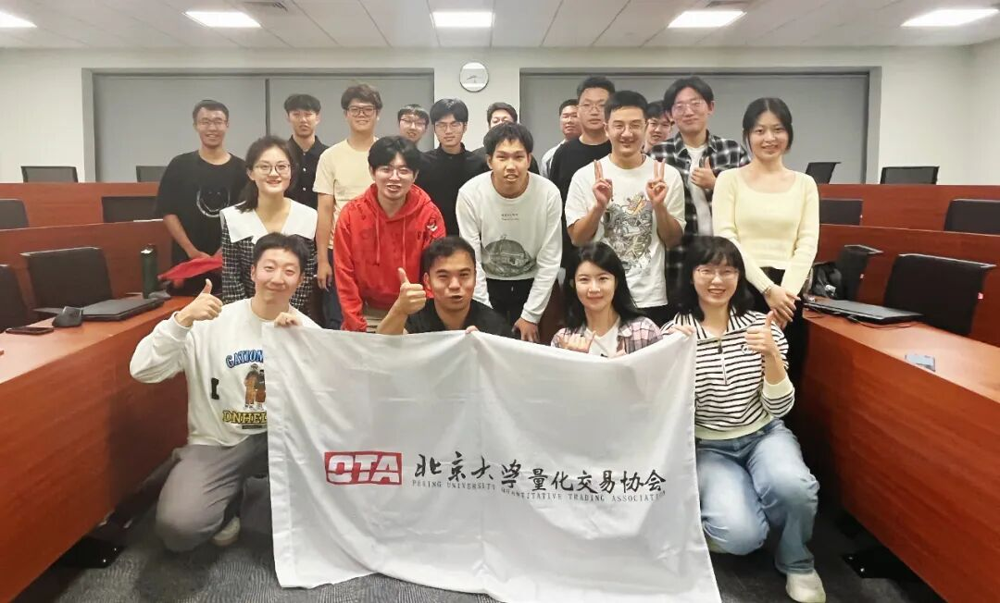

### 主题回顾

**本次主题**：量化大咖面对面

**交流嘉宾**：汪沛

北京大学信息科学与技术学院硕士

CFA、FRM国际金融认证持证人

汪沛先生致力于量化投资10余年，在股票及金融衍生品投资上有丰富的实战经验。先后在中国国际金融有限公司数量金融部、招商证券股份有限公司量化自营部担任高级量化投资经理，负责股指期货套利、分级基金做市与套利、ETF做市与套利、期权做市与套利等量化交易策略。2017年至今，为全球多家交易所及国内外期货公司提供做市商服务，是国内期货做市领域参与最早、品种最多的专业做市商创始人之一。

**主题背景**：根据中国量化白皮书调查显示，行业内普遍认为做好Quant的关键素质先后顺序分别是：扎实的专业技能、聪明、快速领悟、对世界的认知、勤奋努力。聪明有助于单次研究的胜率，而努力则决定长期的水平。当下行业人均学历卷的不能再卷的情况下，还有什么因素推动了一个Quant从优秀走向卓越？

**交流话题**：
1) 如何在工作中，获得正反馈和正向激励？
2) 如果接触金融较晚，想进入量化交易行业需要做哪些准备？
3) 进入人工智能时代，写代码的门槛降低了，在未来5~10年会不会出现代码不需要人来写，而由机器替代的现象？
4) 如何在当下寻找一个值得进入的交叉领域？
5) 对于初次进行交易的新人有何建议？策略的关键之处在何？
6) 随机过程在量化交易中的应用具体在哪方面，在市场上的有效性如何？
7) 量化是否是一个吃青春饭的行业？应如何做好职业规划？
8) 金融证书对于进入量化行业的实质性帮助。

---

### 活动成员

本次活动根据大家填写的报名表，依照“深度交流+多元讨论”的主旨，共邀请20位小伙伴参与，同时感谢北京大学量化交易协会同学们的辛苦筹备与宣传。

---

### 精彩回顾

**1.我们在和谁进行交易？**

总体来分有四类对手盘：情绪化对手盘、被动交易对手盘、代理人对手盘、程序化对手盘。

1）情绪化对手盘，在交易中的恐惧、贪婪、盲目自信，这会让很多交易者陷入交易中的非理性，而这就使我们可以应用行为金融学理论，反向思维与这类对手进行交易。

2）被动交易对手盘，他们因为突发事件或者交易结构影响，不得不与我们进行交易，极端的例子就如，战争时期被动抛售不动产的持有者，或是《大空头》电影里演的被逼平仓的对手盘，这种交易往往是在不得不的情况下进行的。

3）代理人对手盘，其实大家工作之后就会发现，有些人的思维会不知不觉的“机构化”，束缚在规则体系下按部就班的完成指令，很多时候代理人的行为不是以结果正确为导向的，而是以完成指令为导向的，我们可以利用代理人背负沉重的交易KPI从而出现非理智交易行为的特点来进行交易。

4）程序化对手盘，这其实就是我们之前的自己，很多人刚刚进入一个行业，往往觉得自己的想法充满了个性，但其实行为特点都有非常大的共性，我们就可以通过抓住交易行为的共性而进行交易。

**2.我们如何进行交易？**

同学们可以在读书期间试着将一部分想法落地实践，获得宝贵的交易经验，这点非常重要，因为做过就是做过，跑通全流程的人和局部研究的人，在看待问题的视角就会截然不同。大家可以尝试着去从期货交易入手，因为期货接口对所有投资者开放，而且交易一手价格也不高，借助像是聚宽、米筐这样的策略研发平台，跑通一个小的闭环就可以获得真实的交易体验，你在处理真实交易的时候，就会出现各种之前完全没有想到的问题，这样解决起来也更真实有趣。此外，交易时要深耕细分领域，不怕繁琐的脏活累活，拒绝羊群效应、盲目跟从，才能挖掘出好的alpha。

**3.策略开发的四个步骤？**

1）用业务逻辑分析和推理作为策略的骨架；

2）用历史数据的统计和分析作为策略的验证；

3）用模拟交易和自有资金实盘交易，找盘感；

4）随时准备被证伪的心态，不能过度自信。

**4.量化行业有没有35岁危机？**

汪沛总认为人生每个阶段不同，面临的问题和解决方法也就不同。

在35岁的危机的问题上，如果说35岁之前是靠技能赚钱，那么35岁之后就要靠毕业这10年积累的经验和认知赚钱。如果35岁之后还需要和应届生比拼技术和体力，那么大概率是吃亏的，要认真寻找和积淀自己的比较优势。

**5.关于交易中的优势？**

信息不能转化成钱，优势才能。
广义的交易是认知、资源和人品的变现。狭义的交易，仅仅是我们认知的变现。就像是《孙子兵法》说的那样，“是故胜兵先胜而后求战，败兵先战而后求胜"。先胜后战就要求我们要先拥有足够的积累，有了优势再下场交易。

**6.量化推荐书单？**

汪沛总推荐七本书，有三本理论书和四本故事书，交替阅读、逐步递进。
- 第一本《征服市场的人：西蒙斯传》
- 第二本《打开量化投资的黑箱（第2版）》
- 第三本《宽客人生》
- 第四本《打开高频交易的黑箱》
- 第五本《暗池》
- 第六本《行为金融学与投资心理学（原书第6版）》
- 第七本《宽客》
按照推荐的顺序阅读体验更佳哦~


