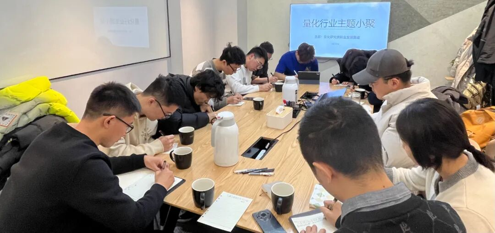

### 主题回顾

**本次主题**：量化研究员职业发展图鉴

**主题背景**：根据中国量化白皮书调查显示，行业内普遍认为做好 Quant 的关键素质先后顺序分别是：扎实的专业技能、聪明、快速领悟、对世界的认知、勤奋努力。聪明有助于单次研究的胜率，而努力则决定长期的水平。当下行业人均学历卷的不能再卷的情况下，还有什么因素推动了一个 Quant 从优秀走向卓越？

**交流话题**：1.从业者分享自己的职业生涯，如工作内容、职业发展等？2.lgbm 因子组合模型？3.端到端选股神经网络的训练，与因子择时是否有必要做？4.品种个数较少的 cta 策略在进行因子组合时是否有必要在因子和品种两个维度都进行权重的调整？5.大家对于另类因子发掘的经验交流？6.应届生头部私募求职经验。

---

### 小聚成员

本次活动根据大家填写的报名表，依照“深度交流+多元讨论”的主旨，一共邀请15位小伙伴参与，从事量化行业全职工作的伙伴7位，目前在量化行业实习的伙伴8位，值得一提的是，参与本次小聚的全职和实习伙伴所在公司多为知名百亿私募、头部券商、自营机构。

---

### 活动反馈

今天学到了很多的知识。各位老师同学的发言都让我学习到了很多。——**某quant爱好者**

今天小聚王同学对高频股票上的树模型建立有一个详细的分享，和钱同学有一个好的交流，收获很多。**——北京私募实习生**

今天聚会石同学提出了关于因子择时的问题，大家的讨论对我很有启发。**——一枚量化小白**

腾飞同学的发言对我很有收获，其中他对于风险的看法确实修正了我主要更认可收益的方法论。对于量化这种复杂的模型套利机制，对于波动等的认知有时候比收益更重要。**——某Quant**

感谢方同学和陈同学的分享，对量化crypto中的应用有一些认知与学习，希望可以进一步交流。**——某量化研究员**

学习到了量化私募的求职技巧和业务发展历史，感谢主办方提供交流机会。**——币圈QuantDev**

希望能多一些公司了解以及找潘同学请教一些kaggle比赛和秋招。**——某量化研究员**

今天王同学和钱同学分享的因子挖掘方法和经验交流对我的启发挺大，学到了一些新的思路和方法，也对CTA有了更深的认识，其他同学分享的模型训练经验也有很大启发。**——某量化爱好者**

每一位同学进入到行业的新认知都很有帮助。**——某私募从业者**

听了几位研究员关于因子挖掘的分享，很有收获，也希望有更多的量化高手参与到加密行业中来。**——Leo**

学习到了机器学习模型中的时间窗口的选择问题以及传统股票与期货在组合中的一些差异。**——钱微子**

王同学认真、求知、真诚的讲述了自己的经验和方向，坦诚沟通虚心请教。**——某Qunat**

了解大家的想法和行业动态。**——某Quant**


