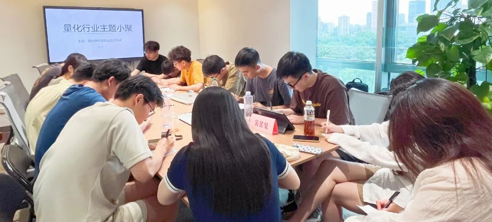

### 主题回顾

**本次主题**：量化研究员职业发展图鉴

**主题背景**：根据中国量化白皮书调查显示，行业内普遍认为做好 Quant 的关键素质先后顺序分别是：扎实的专业技能、聪明、快速领悟、对世界的认知、勤奋努力。聪明有助于单次研究的胜率，而努力则决定长期的水平。当下行业人均学历卷的不能再卷的情况下，还有什么因素推动了一个 Quant 从优秀走向卓越？

**交流话题**：1.从业者分享自己的职业生涯，如工作内容、职业发展等？2.近一年量化私募收益未跑赢主观，未来预期如何？3.投资组合回测值得注意的细节？4.如何基于风格拥挤度进行有效风控？5.不同类型中低频alpha的研究逻辑和技术，如何在基本面因子中结合量价或其他数据？5.实盘感受与因子信号挖掘的瓶颈？

---

### 小聚成员

本次活动根据大家填写的报名表，依照“深度交流+多元讨论”的主旨，一共邀请15位小伙伴参与，从事量化行业全职工作的伙伴11位，目前在量化行业实习的伙伴4位，值得一提的是，参与本次小聚的全职和实习伙伴所在公司多为知名百亿私募、头部券商、自营机构。

---

### 活动反馈

今天Z同学的发言让我很有收获，之前习惯于用常规的IC、PNL、Sharpe等筛选因子，然后最近发现，在那些非线性的机器学习模型中，模型输入的特征并不一定要求与收益之间保持强线性，Z同学的发言让我意识到，因子对模型的预测增量效果更为重要。**——吴易杭**

今天Z同学的发言对我有些启发，注重模型，因子的增量，而不是相关性。另外，有位同学提到某头部私募的因子与相关性，这个对我的震撼比较大，回去测试一下。**——ZW**

今天Z同学和童老师的发言对我启发比较大，分别是从基本面量化+因子挑选以及职业路径的角度学习到了新的信息：1.基本面量化+因子挑选：对于因子入库的标准与组合的关系；基本面信息除构造因子外也可用于构造市场行情相关的信号。2.量化职业路径：长久的量化研究员也不失为比较好的选择。**——公募Intern**

1.Z同学及他队友关于实盘的分享让我收获很大，让我全面地了解一个大A量化（小资金下）如何运作。2.其他人关于基本面量化分析及数据处理的重要性及因子筛选等分享也很有收获。**——ZJ**

今天H老师的发言对我挺有启发的，对于一个行业整体的洞见，她很有独特的角度，结合主观与量化之间的不同点，很有共鸣，学习到很多，希望活动越办越好！**——某量化HR**

因子层面上对因子入库的想法对我很有启发，另外，两位自营PM的小老板同学也给出了一条独特的成长路径，受益匪浅。今天聊的内容都很有深度，期待下次再会！**——某Quant**

感谢高总，跟年轻人交流是一件受益匪浅的事情！**——行业老年人** 

今天S同学的发言对我很有启发，他从模型的角度分享了自己的一些看法，包括模型各环节的一些思考方式。**——Q**

两位Z同学，让我感到量化新生还是很有未来和可以期待的！希望超级量化越来越好！**——TXH**

今日收获：1.因子拥挤未必是坏事。2.注重数据来源。3.对于量化基本面的分享很有见解。4.按劳分配与大锅饭的再思考。**——一个量化小白**

今天听了同业分享的一个因子筛选思路感觉受益很多。**——某QR**

今天Z同学对我很有启发，还有几位行业前辈，在整体因子挖掘，评估的方法论上都给了我很大启发，HR姐姐对行业和个人发展的建议也对我未来发展有很大帮助。**——量化研究员**

基本面因子的思路上，大家探讨了很多关于基本面把控上的操作，涉及到数据来源独特性、idear、宏观从上到下把控上，还有对于因子表现到模型增益的探讨都很有启发。与大家多交流能了解到自己从未涉猎的领域，提供新的启发。**——Jveee**

第一次参加小聚，收获了不少策略上的知识以及对于行业的洞察。我最近专注于量化基本面的策略，Z同学的一些建议和思路对我很有帮助，除了从因子本身逻辑出发，还可以利用这些数据做timing\group，这非常新颖，有待进一步尝试。**——Yumin.Wu**


