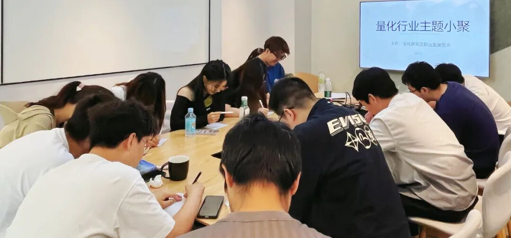

### 主题回顾

**本次主题**：量化研究员职业发展图鉴

**主题背景**：根据中国量化白皮书调查显示，行业内普遍认为做好 Quant 的关键素质先后顺序分别是：扎实的专业技能、聪明、快速领悟、对世界的认知、勤奋努力。聪明有助于单次研究的胜率，而努力则决定长期的水平。当下行业人均学历卷的不能再卷的情况下，还有什么因素推动了一个 Quant 从优秀走向卓越？

**交流话题**：1.从业者分享自己的职业生涯，如工作内容、职业发展等？2.机器学习在日频和分钟频CTA的应用，端到端学习是量化方法论今后变革的可行方向吗？3.未来量化研究发展趋势，随着模型的不断发展，人工挖因子会不会越来越没有优势？4.目前策略研究难点和一些市场上的认识？5.量化期权未来会有更多机会吗？

---

### 小聚成员

本次活动根据大家填写的报名表，依照“深度交流+多元讨论”的主旨，一共邀请15位小伙伴参与，从事量化行业全职工作的伙伴11位，目前在量化行业实习的伙伴4位，值得一提的是，参与本次小聚的全职和实习伙伴所在公司多为知名百亿私募、头部券商、自营机构。

---

### 活动反馈

今天W老师的发言对我很有启发，对因子idea和处理迭代方式有了更深的理解，同时和大家交流了今年行情的看法，对市场进行剖析很有收获。**——某私募QR**

周老师关于因子研究的分享，郑老师关于当前市场就业环境的分享，都收获了很多，学习到很多。**——量化研究员**

今天某QR的发言对我比较有启发，提到了关于如何将市场上接到的信息进行更科学的组合，收益良多，希望可以再多些思考。**——某小白一枚**

W老师和J老师和郑老师的解答对我比较有帮助，从大方向来看，A股未来一段时间还是偏大市值的，目前很多私募业绩不好可能是因为Worldquant的模式，在旧的因子不能适应市场的情况下，新因子的加入并没有明显扭转这个现象，策略不能快速调整，感觉未来可以集中构建低相关的因子。**——无情的旷工**

了解了不同量化私募的方式，不同的做法，很开眼界。**——某量化研究员**

大家对因子分类的讨论，因子特异性的讨论，有收获。**——郑兆磊**

了解了许多组合优化和因子的方法论，特别是因子与模型的权衡，让我受益很多。**——某QR**

今天的W老师发言对我很有启发，在因子研究中，调参数确实是一个比较tricky的问题，考虑相关系数+稳健性确实较为有参考价值。**——量化私募QR** 

今天W老师的发言很有启发，他的组合优化理论让我学习到了更多处理多因子时候的方法。**——某私募实习生**

今天更加深刻了解到了量化这个行业，发现入行的bar也越来越高，真的有私募只要有牌子的人，反正真的不容易，未来要好好加油吖。**——某QR**

辣个男人又迟到了。**——串**

了解多种多样的行业样态，不同研究员对同一问题的不同思考，开拓了很多新思路。做研究不仅要多读文献，深入真实的市场和其他大佬交流也是非常重要的，防止自己闭门造车。**——量化QR**

今天了解了一些组合方向的insight，之前没有太研究过组合，收获很大。而在因子挖掘上，量价确实已经十分卷了，但如何更有效地挖出一些另类的robust的因子也是一个很有价值的课题。感谢超级量化的这次活动！**——某百亿QR**

收获：了解了很多其他公司当前的研究方向，对自己的职业发展和策略拓展方向有了更深的想法。例如，端到端当前的发展状况和遇到的问题。**——某私募QR**


