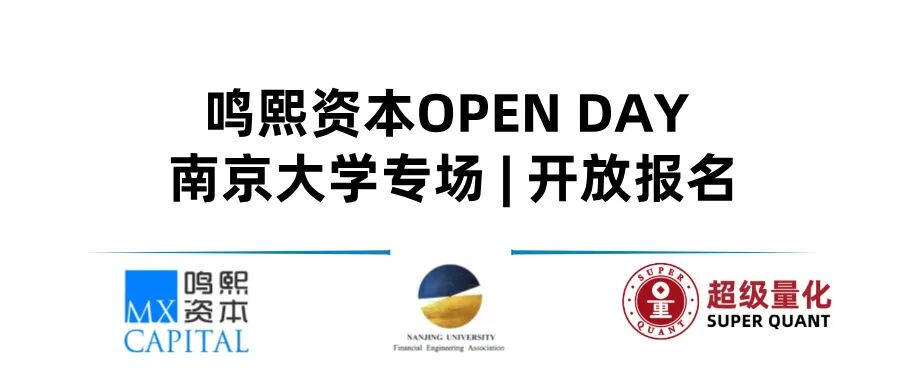
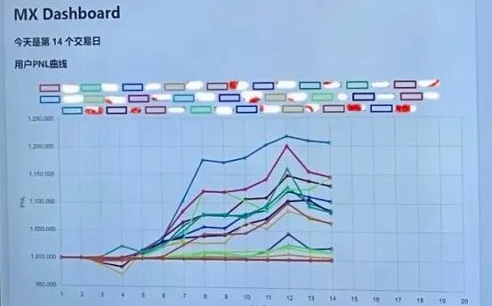
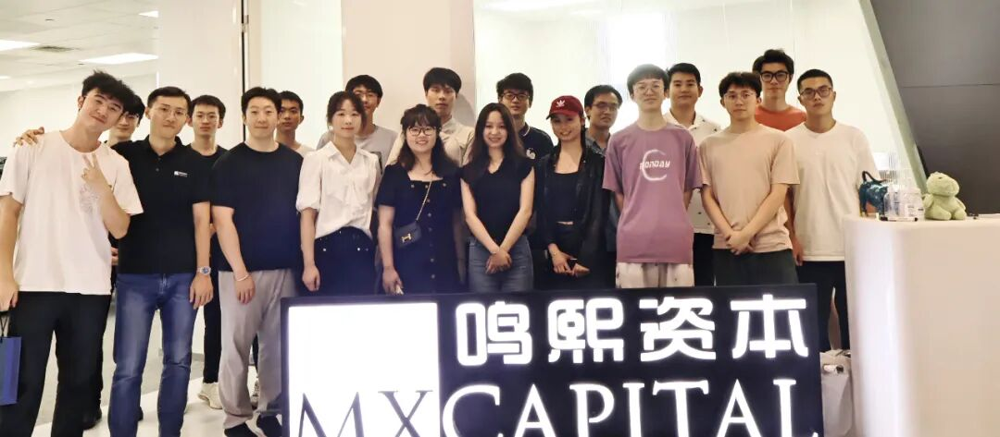

---

### 活动整体回顾
**9:00-9:30** 

破冰开场与公司介绍

嘉宾：张精忠鸣熙市场部负责人，具有丰富的投研和市场经验。

张老师分享了鸣熙企业介绍与当下的量化市场概况，包含公司基本情况简介、量化私募的行业格局与现状、目前监管态度与行业未来展望等，最后回答了同学们关于量化行业的通识问题，如资管公司的资金结构、公司发展模式、行业分层、评价标准等。

**9:30-10:30** 

合伙人介绍量化干货

嘉宾：Michael在美国担任投资经理多年，曾在Point72（前身SAC CAPITAL塞克资本）管理数十亿美金资产，专注量化股票中频策略。

Michael老师分享的部分是量化投资方法论，包含量化投资概览、流程与方法论、机器学习的应用、组合优化研究以及对行业未来的深思。从量化投资的大体框架开始分析，由浅入深，到量化投资中的流程和方法论，也就是“做什么”和“怎么做”。在此基础上，Michael以几个具体的案例展示了机器学习的应用和组合优化研究的方式方法，最后与同学们开放式探讨了对量化行业未来的思考。

内容摘要：

1) Black-Litterman 模型是由 Fischer Black 和 Robert Litterman 在 1992 年提出的一种投资组合优化模型，旨在解决传统均值-方差模型（Mean-Variance Model）中的一些问题，如资产回报预测的高度敏感性以及产生不合理权重配置的情况。该模型结合了资本资产定价模型（CAPM）提供的市场均衡收益率（即市场隐含的回报）和投资者对某些资产的主观看法。其基本思路是将投资者的观点与市场的均衡状态进行融合，从而生成更为稳健且合理的资产配置。模型的基本步骤：市场均衡收益率：Black-Litterman 假设市场处于均衡状态，并使用 CAPM 模型计算各个资产的隐含均衡收益率，作为初始参考。投资者观点：投资者可以对某些资产的预期回报率提出主观看法，这些观点可以是某个资产的回报预期高于市场均值，也可以是多个资产之间的相对回报差异。组合观点与均衡收益率：Black-Litterman 模型将投资者的观点与市场隐含的收益率进行结合，调整后的收益率通过贝叶斯方法进行加权融合，生成新的预期收益率。优化组合：使用调整后的收益率和风险测量，通过均值-方差优化算法来确定最终的资产配置权重。优势：解决了传统均值-方差模型对回报预测敏感的问题；允许投资者根据主观看法调整市场隐含收益率，增加了灵活性和实际应用价值；能够生成合理的权重分布，避免过度集中投资于个别资产。总的来说，Black-Litterman 模型在资产配置中更加稳健，可以有效整合投资者的主观看法与市场信息。
2) 随着金融市场的复杂性和数据量的不断增加，传统的量化研究方法面临着挑战。图神经网络（Graph Neural Networks, GNNs）作为一种新兴的深度学习技术，能够有效处理图结构数据，为量化研究提供了新的工具和视角。
3) 图神经网络的基本组成 GNN 的核心思想是通过“信息传递”机制来处理图结构数据。每个节点通过邻居节点传递信息，不断聚合邻居的信息来更新自己的状态。GNN的基本组成包括以下几个部分： 节点和边的特征表示：GNN接受图中的节点和边作为输入，每个节点可以代表某个金融实体（如股票），每条边代表这些实体间的关系（如行业分类、供应链关系、分析师共同覆盖等）。 信息传递机制：在GNN中，节点通过邻居节点的信息更新自己的表示。常见的聚合函数包括求和、平均或最大值，也可以通过引入注意力机制来进行聚合。 节点嵌入更新：通过神经网络将节点的特征进行非线性转换，逐层更新节点的嵌入表示。每一层网络能够捕捉节点之间更复杂的关系和更远距离的依赖关系。 损失函数与优化：通过修改预测目标，可以使GNN模型提取出金融数据中不同方面的信息 
4) GNN的优势相比于传统的深度学习模型，GNN在量化金融研究中具有以下显著优势： 捕捉复杂的关系结构：传统的时间序列分析或回归模型通常假设资产之间是相互独立的，而GNN能够通过图结构显式建模资产或公司的相互关系，进而捕捉潜在的关联性。 多维特征融合：GNN能够融合节点和边上的多维特征，例如股票的历史价格、公司基本面数据以及市场间的交易关系，实现对复杂市场环境的全方位理解。处理非欧几何数据：金融市场中的很多数据不符合传统欧几里得空间的假设，GNN能够在图结构中处理这类数据，从而提供更为准确的建模结果。动态性与适应性：金融市场中的关系结构是动态变化的，GNN可以通过动态图神经网络（DGN）进行建模，捕捉市场结构的实时变化，为实时投资决策提供更有力的支持。图神经网络作为一种新兴的深度学习技术，具备建模复杂关系结构的能力，在量化金融研究中展现出显著优势。通过引入GNN模型，量化研究人员能够更好地利用金融市场中的关系网络，提升策略的有效性与投资回报。

**10:30-11:00** 

全职研究员分享工作体验

嘉宾：Johnny复旦大学数学学院金融专硕，2022年进入鸣熙实习，2023年return成为鸣熙大家庭的正式员工。

Johnny老师主要分享了鸣熙投研端工作日常与心得，包含鸣熙实习的工作节奏与感受、股票量化研究每天具体需要做什么、选择适合自己的实习需要考虑的角度，最后在QA过程中和大家分享了自己的心路历程给学弟妹一些亲身思考

**11:00-12:00** 

虚拟股神:

初始资金：每位同学将获得100万元的虚拟资金。投资池：提供三个不同行业（电子、公用事业、汽车）的股票，加入投资池。根据每日更新的股票新闻，同学们需要分析这些信息对股价的潜在影响，并做出买卖决策。鸣熙专门开发了简易版专属交易平台供大家进行虚拟操作，比赛结束前每天都会公布大家的持仓市值，看看谁才是那个的“股神”！

花签词：

参与游戏的同学抽取一支签，根据签上给予的信息头脑风暴后提出本组构建因子的思路和灵感，大家就此展开激烈讨论，由Michael老师进行点评与逻辑补全，共同探索金融市场的奥秘。通过这些活动，大家不仅加深了对量化投资的理解，还在欢笑中展示了各自的金融分析与决策能力。

**12:00-13:00**

自由活动与交流经过一上午紧张又充实的活动，同学们都收获满满，再次感谢嘉宾老师们精彩的分享与所有组织人员的辛苦付出！我们期待下一次相聚！

