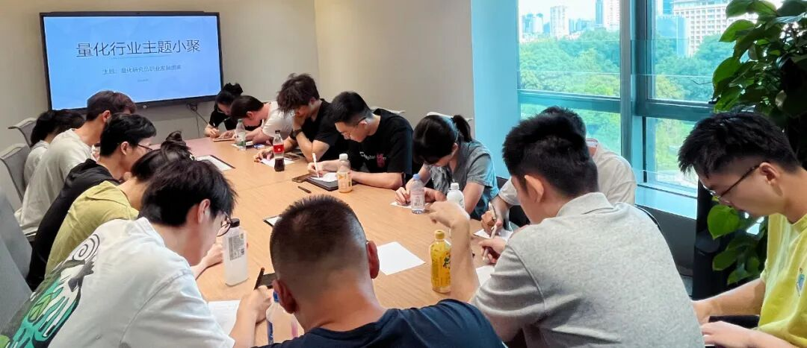

### 主题回顾

**本次主题**：量化研究员职业发展图鉴

**主题背景**：根据量化白皮书调查显示，业内普遍认为做好Quant的关键素质先后顺序分别是：扎实的专业技能、聪明、快速领悟、对世界的认知、勤奋努力。聪明有助于单次研究的胜率，而努力则决定长期的水平。除此之外，还有哪些因素可以推动Quant从优秀走向卓越？

**交流话题**：1.从业者分享自己的职业生涯，如工作内容、职业发展等？2.高频策略限制下的影响与量化行业在中国未来的发展趋势？3.因子挖掘的思路，对于模型组合的一些思考？4.如何使用分析师数据做基本面因子，训练深度学习模型损失函数的设计思路？5.实盘感受与因子信号挖掘的瓶颈？

---

### 小聚成员

本次活动根据大家填写的报名表，依照“深度交流+多元讨论”的主旨，一共邀请15位小伙伴参与，从事量化行业全职工作的伙伴8位，目前在量化行业实习的伙伴7位，值得一提的是，参与本次小聚的全职和实习伙伴所在公司多为知名百亿私募、头部券商、自营机构。

---

### 活动反馈

对大行业的了解，对工作也是有好处的。eg.何时减持，后面还会增持回来，利于预测。预测的terget可以是最终的结果，也可以是过程。eg.最终的结果：一周收益率，过程：一周内的形态。**——某百亿私募打工人**

非常开心参与到今天的活动中。其中丁老师对于“懂金融”对从事量化必要性的回答使我受益匪浅，自身去尝试手工交易，去联结主观投资人士，去了解他们的一些idea，再通过代码落地实证等等，都是可能有帮助加强对金融的认知而不仅仅局限于数据与模型。感谢！**——某期权QR**

今天听到的关于因子模型筛选和平滑化的内容对我很有启发。之前考虑换手率问题时主要专注于择时方面，考虑直接去除某些表现不平滑的因子，今天学到了其他的方法。**——金工大四学生**

今天是我第一次参加量化小聚，很高兴认识大家。X老师的发言让我收获很多，作为一名实习生听到了许多从业者的分享，对金融私募行业有了更深的见解。**——量化私募实习生**

今天丁同学分享了一些关于不同资产的交易观点，对我很有启发，打开了我新的研究思路！**——某量化研究员**

今天L同学分享的分析师数据增强方案很有意思，解决了分析师覆盖率不足的问题，感觉很有深入探索的价值。**——Yumin**

C同学关于分时label的处理，对我有一些启发。**——某私募实习生** 

今天K同学讲的路径依赖的label标注方法很有趣，期待下次小聚再一起讨论！**——从业QR**

C老师提到的直接平均T+1~T+10收益的操作很有启发！之前一直想得太复杂，总认为要从因子本身的统计特征入手降低换手率，现在明白更应该从收益出发，对因子进行处理。**——某量化实习生**

今天S老师的发言对我启发很大，我之前没有接触过深度学习相关的研究，这次交流让我对深度学习和组合优化了解更深。**——某QR**

今天丁老师的发言对我很有启发，让我作为一个新人实习生对量化行业有了更深入的理解。比如因子的组合、筛选应怎么采用有逻辑的方式。**——某QR intern**

今天收获很大，学到了不少东西。**——量化从业者**

今天某位对因子模型中，因子缺失进行补充的方法令我印象深刻，是今天最大的收获。**——某交易员**

启发：1）对于组合管理优化可以尝试不同的方法，不仅限于常用的Barra优化等。2）优化换手率通常从因子层面，也可以另辟，即从label层面优化。**——某小私募研究员**


