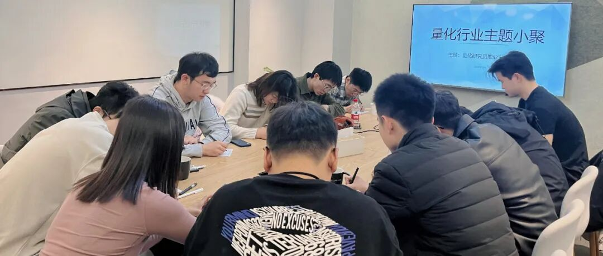

### 主题回顾

**本次主题**：量化研究员职业发展图鉴

**主题背景**：根据中国量化白皮书调查显示，行业内普遍认为做好 Quant 的关键素质先后顺序分别是：扎实的专业技能、聪明、快速领悟、对世界的认知、勤奋努力。聪明有助于单次研究的胜率，而努力则决定长期的水平。当下行业人均学历卷的不能再卷的情况下，还有什么因素推动了一个 Quant 从优秀走向卓越？

**交流话题**：1.从业者分享自己的职业生涯，如工作内容、职业发展等？2.量化研究中因子的筛选和组合问题？3.金融市场中的序列预测研究？4.真的可以用模型实现风格择时吗？5.如何成为基金经理与基金经理未来的职业方向。

---

### 小聚成员

本次活动根据大家填写的报名表，依照“深度交流+多元讨论”的主旨，一共邀请15位小伙伴参与，从事量化行业全职工作的伙伴12位，目前在量化行业实习的伙伴3位，值得一提的是，参与本次小聚的全职和实习伙伴所在公司多为知名百亿私募与头部自营机构。

---

### 活动反馈

今天王同学提出的关于择时的方法与见解十分有趣，给了我很多启发。**——从业QR**

王同学对于因子组合的思路、by老师对于从程序员转为PM的职业经历对我很有启发，T老师和东哥对于竞业的话题讨论也很有意义。**——炸花生**

今天对挖因子训模型有了更多认知。**——某私募量化研究员**

今天张老板的发言让我觉得很有趣，他善于表达，比较open，也很亲和，让我了解到很多行业内的思考和一些“特殊”技巧。**——某高频从业**

今天张老板的发言给了很多因子组合和模型优化的灵感，张老板还是一如既往的全面。**——一个离开量化又回来求复合的QR**

干货很多，很有启发和收获，很好的一次聚会。**——某QR**

今天张老板关于从DL相关方法论对我研究有较大启发，对因子和非线性东西的理解上有提升。**——某人**

今天王老师的发言令我很有启发，总结了做因子和筛因子的时候的一些方法论，收获很大。之后还有很多的方向可以尝试和深耕。**——某百亿QR** 

今天Z总的发言对我很有启发。他对于股票的因子筛选和神经网络方法方面的很多介绍很好，例如，因子的筛选方法论。感谢本次活动，支持！**——Ethem**

今天张老师的分享对我很有启发，弱特征+机器学习，其实在风格暴露上不至于太偏激，这是个蛮好的方向。**——某百亿QR**

了解到了和传统多因子框架不同的信号产生方式和投研体系，对我之后在多因子框架下的研究思路有启发和拓展作用。**——QR**

今天张老师的发言对我比较有启发，他提到了一些组合的方法，让我重新对做model有了新的看法，获益匪浅。—**—某小白一枚**

每次来都可以看到很多老朋友和前同事，也认识了很多新朋友，大家一起聊聊天说说话，感觉很放松，还能了解到目前市场更多的信息，很赞！**——某私募从业**


