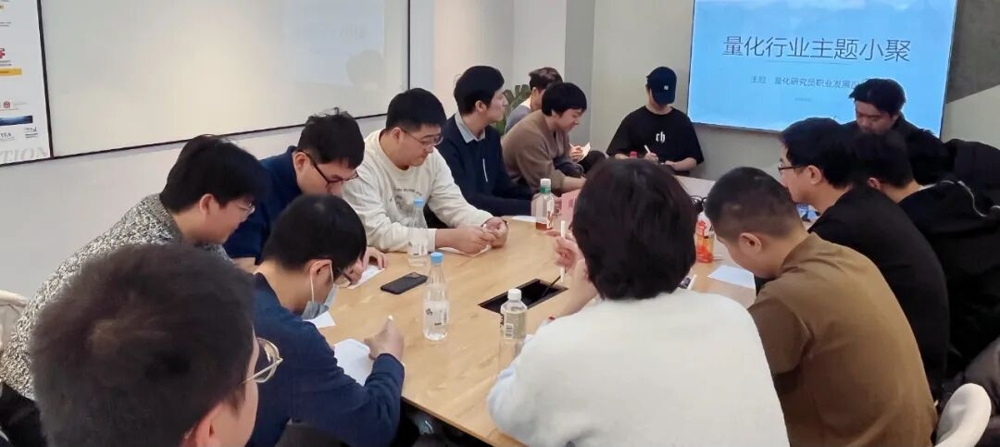

### 主题回顾

**本次主题**：量化研究员职业发展图鉴

**主题背景**：距离2025年结束还有不到4周，大家又到了复盘过去一年成果，展望明年的关键时刻。根据量化白皮书调查显示，业内普遍认为做好Quant的关键素质先后顺序分别是：扎实的专业技能、聪明、快速领悟、对世界的认知、勤奋努力。聪明有助于单次研究的胜率，而努力则决定长期的水平。除此之外，还有哪些因素可以推动Quant从优秀走向卓越？

**交流话题**：1.从业者分享自己的职业生涯，如工作内容、职业发展等？2.Deepseek-R1类强化学习？3.基于深度学习的因子挖掘方法与在多因子框架以外，如何获得超额收益？4.特征挖掘方法，与高频模式识别策略、模型？5.研究员的成长路径与未来的职业方向。

---

### 小聚成员

本次活动根据大家填写的报名表，依照“深度交流+多元讨论”的主旨，一共邀请16位小伙伴参与，从事量化行业全职工作的伙伴13位，目前在量化行业实习的伙伴3位，值得一提的是，参与本次小聚的全职和实习伙伴所在公司多为知名百亿私募、头部券商、自营机构。

---

### 活动反馈

今天的分享会上听到了很多前辈们分享自己的研究心得和体会，给我关于职业生涯的发展的想法提供了很多启发和多样化的视角，感谢组织这样的活动。**——某QR实习生**

今天Z老师的发言对我很有启发，了解了很多研究之外的信息。**——某百亿QR**

今天G2T的分享很有帮助，知道了有大模型辅助做舆情分析交易的方法论，其重点是特征工程，可以后续探索一下。**——某QR**

今天周同学的发言对我有一些启发，包括如何去从一个更高维来看待量化行业职业的发展及如何做出更好的策略。**——某小白一枚**

Z同学分享了在机器学习选因子方面的几篇论文，受益匪浅！**——量化QD**

今天从因子挖掘、模型研究到组合优化，对不同频率的信号进行很深入的交流探讨，特别是今天学到的关于组合优化、风险控制的内容，让我了解到了信号生成后的注意事项，很感谢东哥把大家组织起来，希望之后多多交流。**——某刚入量化的小白**

今天的分享会中G同学的发言很有启发，之前对另类数据的探索和利用还比较少，重点应该还是在数据处理和特征工程上做的不够多。感谢高老板组织的活动，很有收获。**——某百亿QR**

了解了量化同行的现状，也证实了一些自己的猜测。**——某QR**

互相了解行业内不同策略，不同市场，不同规模的公司在做什么事情，比如讲到的另类数据和大模型，是平时没有接触到的东西。**——剑宇**

今天对于CS/AI背景如何在量化领域做出建树的话题讨论比较受启发。**——某QR**

今天的收获，了解同行的信息，知道了其他公司的规模与架构。**——QR**

孙老师的关于整体行业的分享比较有收获，更加了解整个流程。**——某QR**

了解大家的发展路径，对具体工作思路有了想法。**——孙恺伟**


