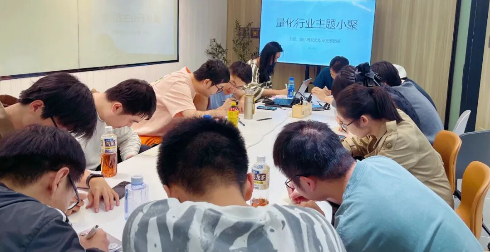

### 主题回顾

**本次主题**：量化研究员职业发展图鉴

**主题背景**：根据中国量化白皮书调查显示，行业内普遍认为做好 Quant 的关键素质先后顺序分别是：扎实的专业技能、聪明、快速领悟、对世界的认知、勤奋努力。聪明有助于单次研究的胜率，而努力则决定长期的水平。当下行业人均学历卷的不能再卷的情况下，还有什么因素推动了一个 Quant 从优秀走向卓越？

**交流话题**：1.从业者分享自己的职业生涯，如入行原因、工作内容、职业发展？2.如何开始学习量化投资以及获得第一份实习或全职机会？3.如何利用开源量化工具和数据在学校阶段自学与提升量化能力？4.如何开启自己的第一个实盘交易？5.如何更好地结合传统投资理论和量化技术构建投资策略？

---

### 小聚成员

本次活动根据大家填写的报名表，依照“深度交流+多元讨论”的主旨，一共邀请15位小伙伴参与，从事量化行业全职工作的伙伴10位，目前在量化行业实习的伙伴5位，值得一提的是，参与本次小聚的全职和实习伙伴所在公司多为知名百亿私募、头部券商、自营机构。

---

### 活动反馈

强烈建议在座的大佬们开一次量化脱口秀专场！量化哲学家们的思想碰撞真的太有趣了！希望之后多多举办上海量化小聚。**——努力探索的量化私募小白**

收益更多的来源于市场错配，而市场错配可以更加广义一点，打开思路才能成就未来。**——某百亿私募量化哲学家**

本次交流，了解到了大家在量化行业中遇到的一些问题、困惑、迷茫，以及对这些问题的谈论帮助每个人发现很多疑问不仅仅存在于自己这里，很多问题充满共性，非常感谢组织者提供的机会，希望活动可以一直办下去！**——一个行业小白**

这次交流带来最多的是交易本质的了解，不一定需要用复杂的模型，AlphaL来源是多元的。**——某基金股票Alpha实习生**

拓宽了对量化的认知。市场的规则、挖因子的困惑、赛道的选择、职业方向的规划等等，感谢主办方。**——某研究CTA的量化小白**

认识到了与自己研究方向相同的朋友，学到了很多新的知识与领域，未来的研究方向更加清晰。**——某即将入学计算机博士的数学本科生**

这次量化小聚很有意义，见到了很多有趣的大佬。其中分享的人生哲学和技术都令我受益匪浅。很感慨的一点是视野不能受限，不能仅限于自己的一亩三分地，以及世上有太多可以赚钱的思路，而量化Alpha只是其中的小小一隅罢了。道阻且长，吾将上下而求索。**——某百亿量化研究员**

很高兴有这么一个难得的交流机会。可深可浅，从具体策略能上升到人生的Alpha，人生皆可量化。**——量化行业初入门打杂一名**

收获：认识了不同细分领域的愿意分享的朋友！！！**——探索哲学和科学在Trading的应用的人**

感谢主办方组织的这场活动，十分有趣，感觉学到了很多东西！**——某百亿私募全职QR**

收获：get了一些职业规划的建议，包括一些有意思的人生哲理。**——刚入行量化寻找突破的小白**

今天既听到了自营大佬的规则Alpha，又听到了外资大佬的职场Alpha，收获颇丰。**——一个初入量化的小白 实习中**

收获满满的一次行业聚会！规则套利的方法来自一位crypto大佬，充满了交易的智慧~回测框架的建构也是精益求精，细节导向的精细活儿。向大家学习！**——某小量化私募超级小白实习生**

了解了机器学习&深度学习在量化行业中的应用。听了好几场脱口秀，聊了一些人生哲学！**——量化私募研究员一枚**

收获满满，听到了许多大佬的见解分享，对量化行业有了更多的了解，非常有收获的活动。**——某量化实习小白**

