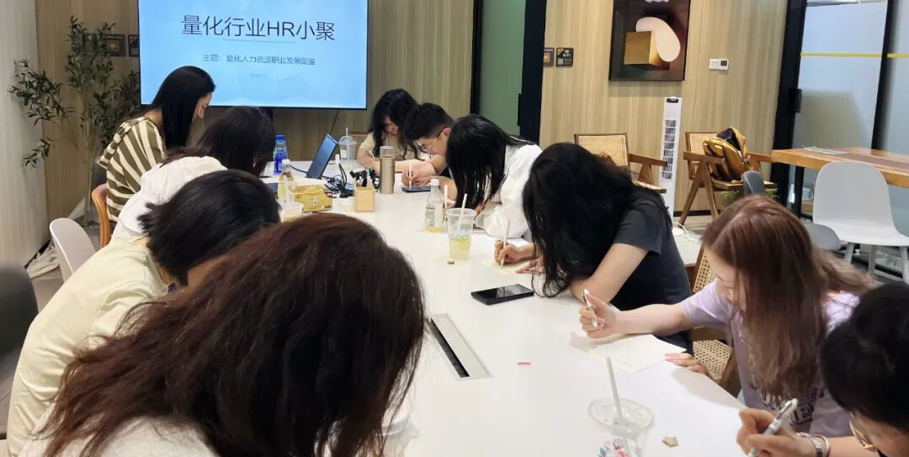

### 主题回顾

**本次主题**：量化人力资源职业发展图鉴

**主题背景**：根据中国量化白皮书数据显示，截至2022年12月末，在协会登记的私募管理人中涉及量化策略的机构共计2293家，量化私募中100亿以上规模共计39家，50~100亿规模共计36家，20~50亿规模共计126家，10~20亿规模共计184家。量化私募一方面对人才的要求越来越高，另一方面获取人才途径和人才画像也越来越趋同，作为量化行业HR，应该如何找到公司人才阿尔法与自身在行业的独特性和竞争力？

**交流话题**：1.从业者分享自己的职业生涯，如入行原因、工作内容、职业发展？2.国内量化投资人才招聘市场现状和前景？3.量化行业HR工作中遇到的困难与挑战，以及解决方案的分享与讨论？4.如何更好地结合海外对冲基金或互联网大厂经验，构建人才招聘策略与内部文化氛围？5.我们应该通过什么方式提升自己的行业竞争力？

---

### 小聚成员

本次活动根据大家填写的报名表，依照“深度交流+多元讨论”的主旨，一共邀请14位小伙伴参与，从事量化行业HR的伙伴12位，此外为了增加讨论角度的多元与内容的深入，我们也邀请了外资Quant大佬1位，国内Top私募 Quant实习生1位。

---

### 活动反馈

这次活动非常棒，与同行交流经验、心得、体会。继续组织下去！！！**——百亿私募招聘经理一枚**

听到了大家遇到的问题和困境，一下子找到了组织！突然发现不只有自己遇到了这些，并且这些问题都在很多公司形成了成熟的解决方案。希望可以未来和各位老师多多交流，一起学习分享，共同进步。**——一位每天认真找候选人的量化HR**

做HR是一件需要长期学习的事情，也需要不要自满，保持真我！**——一位可爱的量化HR**

通过这次活动非常好的了解了量化行业的人才特点，能有机会跟大家交流招聘心得，希望之后可以多举办这样的活动。**——入行一年的量化HR**

深度沟通，从不同角度讨论量化，希望以后有更多机会和大家共聚。**——某上海量化私募HR**

很热闹的专业趴，问题精准，沟通坦率，有思考有突破，有意思！**——喜欢交流的量化HR**

感受到各家面对的各类困境，也得到很多想法和答案，收获满满！！**——上海量化私募HR一枚**

1.认识了很多优秀的HR小姐姐，2.了解了行业内各家优秀同行的经验，3.不同角色的观点碰撞。**——可爱的量化HR小姐姐一枚**

感受到时间过得很快，了解到HR的困惑大致相似，但是大家整体都对行业充满信心，感谢组织！**——某量化私募人力资源经理**

活动内容丰富，HR同行们带来了很多干货，也分享了行业内的八卦，学到了很多，期待下次！**——量化HR小姐姐一枚**

